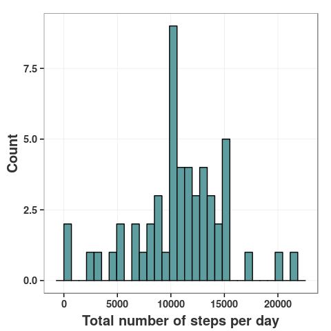
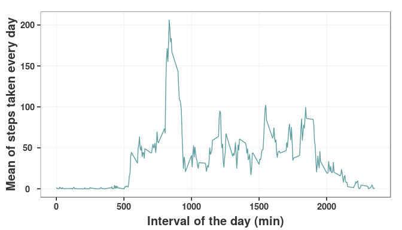
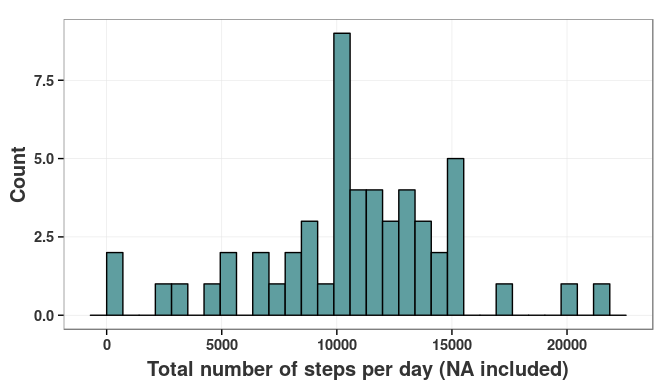
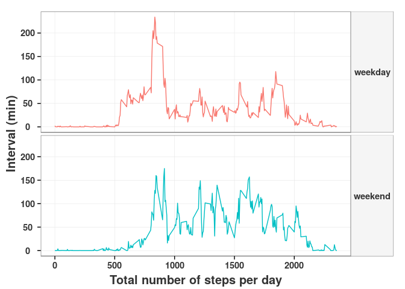

# Reproducible Research: Peer Assessment 1
Álvaro  
September 2015  

#Introduction 

It is now possible to collect a large amount of data about personal movement using activity monitoring devices such as a Fitbit, Nike Fuelband, or Jawbone Up. These type of devices are part of the “quantified self” movement – a group of enthusiasts who take measurements about themselves regularly to improve their health, to find patterns in their behavior, or because they are tech geeks. But these data remain under-utilized both because the raw data are hard to obtain and there is a lack of statistical methods and software for processing and interpreting the data.

This assignment makes use of data from a personal activity monitoring device. This device collects data at 5 minute intervals through out the day. The data consists of two months of data from an anonymous individual collected during the months of October and November, 2012 and include the number of steps taken in 5 minute intervals each day.

## Libraries 


Before to begin with the assessment, we are loading libraries requiered. In this case we load: ggplot2, dplyr, lubridate.


```r
ipak <- function(pkg){
        new.pkg <- pkg[!(pkg %in% installed.packages()[, "Package"])]
        if (length(new.pkg)) 
                install.packages(new.pkg, dependencies = TRUE)
        sapply(pkg, require, character.only = TRUE)
}

ipak(libraries_load)
```

## System Information
In order to replicate or reproduce the analyses, I think that it must be useful to supply system information:

1. Platform: x86_64-pc-linux-gnu
2. R version: R version 3.2.2 (2015-08-14)
3. Date: 2015-09-20

And as no english native speaker I decided to change my configuration to  by means of `en_US.UTF-8`:


```r
Sys.setlocale("LC_TIME", "en_US.UTF-8")
```

```
## [1] "en_US.UTF-8"
```


# Loading and preprocessing the data

First of all we established our working directory by means of `getwd()` and unzip and load data:


```r
unzip("activity.zip")
data_act=read.csv("activity.csv")
```

Then we can format and transform variables as we want. In this case I decided to transform dates to julian days.


```r
data_act$date=as.Date(data_act$date)
data_act$julian=julian(data_act$date,origin=min(data_act$date))
```

Now we can start to answer questions.

#Questions

## What is mean total number of steps taken per day?

1. Calculate the total number of steps taken per day

```r
by_day=group_by(data_act,julian)
steps_per_day=summarise(by_day,sumatory=sum(steps, na.rm=TRUE),average=mean(steps))
steps_per_day=filter(steps_per_day, sumatory!=0)
```

2. Make a histogram of the total number of steps taken each day

```r
ggplot(data=steps_per_day,aes(x=sumatory))+
        geom_histogram(fill="cadetblue",colour="black")+
        ylab("Count")+xlab("Total number of steps per day")+
        theme_bw()+
        theme(panel.grid.minor=element_blank(),
              axis.text.x = element_text(colour="grey20",size=11,angle=0,hjust=.5,vjust=.5,face="bold"),
              axis.text.y = element_text(colour="grey20",size=11,angle=0,hjust=.5,vjust=.5,face="bold"),
              axis.title.y = element_text(colour="grey20",size=15,angle=90,hjust=.5,vjust=1,face="bold"),
              axis.title.x = element_text(colour="grey20",size=15,angle=0,hjust=.5,vjust=-0.2,face="bold"),
              legend.key=element_blank()
        )
```




3. Calculate and report the mean and median of the total number of steps taken per day


```r
mean(steps_per_day$sumatory)
```

```
## [1] 10766.19
```

```r
median(steps_per_day$sumatory)
```

```
## [1] 10765
```

The mean and median of the total number of steps taken per day are **10766.19** and **10765** respectively. 

## What is the average daily activity pattern?

1. Make a time series plot (i.e. type = "l") of the 5-minute interval (x-axis) and the average number of steps taken, averaged across all days (y-axis).


```r
by_interval=group_by(data_act,interval)
steps_per_interval=summarise(by_interval,media=mean(steps,na.rm=TRUE))

ggplot(data=steps_per_interval,aes(x=interval,y=media))+
        geom_line(colour="cadetblue")+
        ylab("Mean of steps taken every day")+xlab("Interval of the day (min)")+
        theme_bw()+
        theme(panel.grid.minor=element_blank(),
              axis.text.x = element_text(colour="grey20",size=11,angle=0,hjust=.5,vjust=.5,face="bold"),
              axis.text.y = element_text(colour="grey20",size=11,angle=0,hjust=.5,vjust=.5,face="bold"),
              axis.title.y = element_text(colour="grey20",size=15,angle=90,hjust=.5,vjust=1,face="bold"),
              axis.title.x = element_text(colour="grey20",size=15,angle=0,hjust=.5,vjust=-0.2,face="bold"),
              legend.key=element_blank()
        )
```



2. Which 5-minute interval, on average across all the days in the dataset, contains the maximum number of steps?


```r
maximum=filter(steps_per_interval,media==max(media))
maximum_period=seconds_to_period(maximum$interval*60)
maximum
```

```
## Source: local data frame [1 x 2]
## 
##   interval    media
##      (int)    (dbl)
## 1      835 206.1698
```

The 5-minute interval which shows the maximum number of steps (on average across all days) is 835 which corresponds to 13H 55M 0S.


## Imputing missing values

Note that there are a number of days/intervals where there are missing values (coded as `NA`). The presence of missing days may introduce bias into some calculations or summaries of the data.

1. Calculate and report the total number of missing values in the dataset (i.e. the total number of rows with `NA`s)

```r
sum(is.na(data_act$steps))
```

```
## [1] 2304
```
2. Devise a strategy for filling in all of the missing values in the dataset. The strategy does not need to be sophisticated. For example, you could use the mean/median for that day, or the mean for that 5-minute interval, etc. I decided to use **the mean for the day** where `NA` steps values were in.
 - Group data by julian day
 - Summarise data by day and I calculated `sum` and `mean` for steps values.
 - Merge `data_act` and `steps_per_day` data frames by julian day values.
 - Change `NA`values by `mean`values

3. Create a new dataset that is equal to the original dataset but with the missing data filled in.

```r
by_day=group_by(data_act,julian)

steps_per_day=summarise(by_day,sumatory=sum(steps, na.rm=TRUE),average=mean(steps))
steps_per_day$average=ifelse(is.na(steps_per_day$average),0,steps_per_day$average)

data_act_na=merge(data_act,steps_per_day,by="julian")

data_act_na[is.na("steps"),"steps"]=data_act_na[is.na("steps"),"average"]
```

4. Make a histogram of the total number of steps taken each day and calculate and report the mean and median total number of steps taken per day.


```r
by_day_na=group_by(data_act_na,julian)
steps_per_day_na=summarise(by_day_na,sumatory=sum(steps, na.rm=TRUE),average=mean(steps))
steps_per_day_na=filter(steps_per_day, sumatory!=0)

ggplot(data=steps_per_day_na,aes(x=sumatory))+
        geom_histogram(fill="cadetblue",colour="black")+
        ylab("Count")+xlab("Total number of steps per day (NA included)")+
        theme_bw()+
        theme(panel.grid.minor=element_blank(),
              axis.text.x = element_text(colour="grey20",size=11,angle=0,hjust=.5,vjust=.5,face="bold"),
              axis.text.y = element_text(colour="grey20",size=11,angle=0,hjust=.5,vjust=.5,face="bold"),
              axis.title.y = element_text(colour="grey20",size=15,angle=90,hjust=.5,vjust=1,face="bold"),
              axis.title.x = element_text(colour="grey20",size=15,angle=0,hjust=.5,vjust=-0.2,face="bold"),
              legend.key=element_blank()
        )
```



```r
mean(steps_per_day_na$sumatory)
```

```
## [1] 10766.19
```

```r
median(steps_per_day_na$sumatory)
```

```
## [1] 10765
```

*Do these values differ from the estimates from the first part of the assignment?*
 
 No. Both mean and median values are exactly equal to those reported for non NAN included data.
 
 *What is the impact of imputing missing data on the estimates of the total daily number of steps?*
 
 No one, there is not any effect over estimations of total daily number of steps.


## Are there differences in activity patterns between weekdays and weekends?

1. Create a new factor variable in the dataset with two levels – “weekday” and “weekend” indicating whether a given date is a weekday or weekend day.


```r
data_act$weekday=ifelse(weekdays(data_act$date)%in%c("Saturday","Sunday"),"weekend","weekday")
data_act$weekday=factor(data_act$weekday)
```

2. Make a panel plot containing a time series plot (i.e. `type = "l"`) of the 5-minute interval (x-axis) and the average number of steps taken, averaged across all weekday days or weekend days (y-axis).


```r
by_weekday=group_by(data_act,weekday,interval)
steps_per_day_int=summarise(by_weekday,steps_mean=mean(steps, na.rm = T),
                            steps_sum=sum(steps, na.rm = T))

ggplot(steps_per_day_int,aes(x=interval,y=steps_mean, colour=weekday))+
        geom_line()+
        facet_grid(weekday~.)+
        ylab("Interval (min)")+xlab("Total number of steps per day")+
        theme_bw()+
        theme(panel.grid.minor=element_blank(),
              axis.text.x = element_text(colour="grey20",size=11,angle=0,hjust=.5,vjust=.5,face="bold"),
              axis.text.y = element_text(colour="grey20",size=11,angle=0,hjust=.5,vjust=.5,face="bold"),
              axis.title.y = element_text(colour="grey20",size=15,angle=90,hjust=.5,vjust=1,face="bold"),
              axis.title.x = element_text(colour="grey20",size=15,angle=0,hjust=.5,vjust=-0.2,face="bold"),
              strip.text.y= element_text(colour="grey20",size=11,vjust=.5,angle=0,face="bold"),
              legend.key=element_blank(),
              legend.position="none",
              strip.background=element_rect(fill="WhiteSmoke"),
              strip.background=element_blank()
        )
```



Different patterns between weekdays and weekends are evident. During weekend the total number of steps are extended during all day, whereas weekdays show a evident maximum number of steps over 13 H 55 S. On the ohter hand, during weekdays the activity begins more early in the morning than in weekend days. All these differences could be attributed to different behaviour patterns of workday-freeday. 
